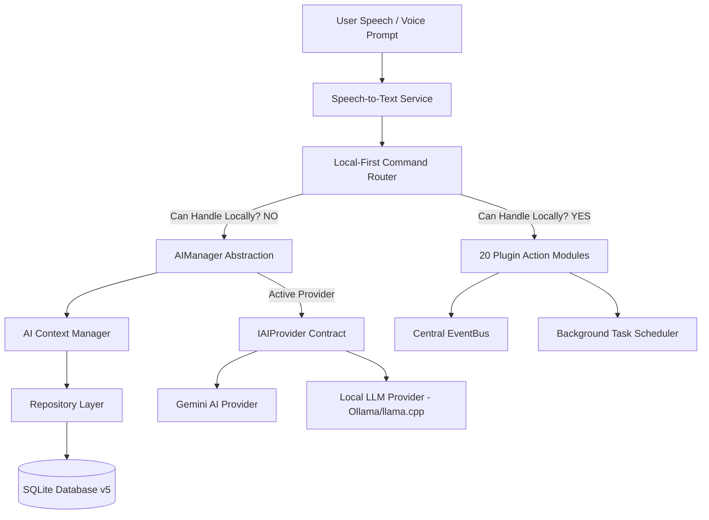

# FRIDAY Lite v1 – Personal AI Android Assistant

**Version**: `FRIDAY Lite v1.0.0`  
Inspired by JARVIS / FRIDAY — A fast, modular, lightweight, privacy-friendly, battery-efficient personal AI assistant built with Flutter Clean Architecture and a Python Flask backend.

---

## 🌟 Key Architecture & Philosophy

1. **Local-First Command Router**:
   Commands like Calls, SMS, Contacts, App Launcher, Notes, Reminders, Calendar, Alarms, To-Do, Battery, Device Info, Settings, Flashlight, and Camera Vision are handled locally on device with **zero network latency** without calling cloud AI.

2. **Strict Power Mode (Highest Priority)**:
   - **OFF Mode (Default)**: No microphone access, no AI processing, no background services, no timers, zero battery consumption beyond the app existing. Releases every hardware resource immediately.
   - **ON Mode**: Initialized lazily. Starts listening loop safely.

3. **Decoupled Architecture & SOLID Principles**:
   - **No UI Widget or Action Module communicates directly with AI providers**. All AI communication flows through the `AIManager` abstraction.
   - **No Component communicates directly with SQLite**. All database access goes strictly through Repository interfaces (`IChatRepository`, `ISettingsRepository`, `IMemoryRepository`, `INotesRepository`, `IContactsRepository`, `IRemindersRepository`, `IAppLauncherRepository`, `IAutomationRepository`).
   - **No Module requests Android permissions directly**. All permission requests go through the centralized `PermissionManager`.

---

## 📐 Architecture Diagram



---

## 📱 Registered Modules Matrix

| Category | Modules | Key Capabilities |
| :--- | :--- | :--- |
| **Telephony & SMS** | Phone, SMS, Contacts | Call contact, dial number, draft SMS with voice confirmation, search contacts & favorites |
| **Productivity** | Notes, Reminders, Calendar, Alarm, To-Do, Clipboard | Natural time parsing ("tomorrow morning", "every Monday"), voice notes, agenda, task lists |
| **Device Control** | Flashlight, Settings, Battery, Device Info, Time/Date | Torch control, Wi-Fi, Bluetooth, Hotspot, Display, Volume, Silent Mode, Airplane Mode |
| **App Launcher** | Intelligent App Launcher | Fuzzy app matching ("insta", "tube", "music"), categories, usage stats, recent & favorite apps |
| **Camera Vision** | Camera Vision Platform | Decoupled `VisionPipeline`, QR/Barcode scanner, OCR text reader, face & object detection |
| **Long-Term Memory** | Memory System | 5 memory types (`conversation`, `preference`, `knowledge`, `relationship`, `task`), ranking, expiration |
| **Desktop Companion**| Desktop Companion System | Remote PC control over TCP/WebSocket: screenshot, volume, clipboard sync, apps, terminal commands |
| **Automation Engine**| Automation Engine | Trigger-condition-action rules (battery <20%, headphones, arriving home, bedtime schedule) |
| **Smart Home** | Smart Home Platform | Decoupled adapter plugins (Home Assistant, Google Home, Alexa, Matter, Zigbee, MQTT, BLE) |
| **Local AI** | Local LLM Provider | 100% offline chat, intent classification, summaries, and reasoning via Ollama / llama.cpp |

---

## 🚀 Quickstart Guide

### 1. Prerequisites
- Flutter SDK (3.x or higher)
- Android Studio / Android SDK (API level 21+)
- Python 3.9+ (for Flask AI Backend & Desktop Companion)

### 2. Running the Python Flask AI Backend
```bash
cd friday_backend
python -m venv venv
# On Windows:
venv\Scripts\activate
# On Linux/macOS:
source venv/bin/activate

pip install -r requirements.txt
python app.py
# Backend runs on http://127.0.0.1:5000
```

### 3. Running the Python Desktop Companion Service (Optional)
```bash
cd friday_backend/services
python desktop_companion_service.py
# Desktop Companion Server runs on port 8765
```

### 4. Running the Flutter Android Application
```bash
cd friday_app
flutter pub get
flutter run
```

---

## 🛠️ Verification Commands

```bash
# Flutter Static Analysis (Zero Warnings / Zero Errors)
flutter analyze --no-fatal-infos

# Flutter Unit & Integration Tests
flutter test

# Python Backend Test Client
python -c "from app import app; client = app.test_client(); print(client.get('/health').get_json())"
```

---

## 📄 Release Notes — Version 1.0.0

- **Initial Production Release of FRIDAY Lite v1**.
- **Complete Clean Architecture & SOLID implementation**.
- **Local-first command routing with 20 plugin feature modules**.
- **Strict Power Mode zero-resource OFF state**.
- **Camera Vision Platform, Long-Term Memory System, Desktop Companion, Automation Engine, and Smart Home Framework fully integrated**.
